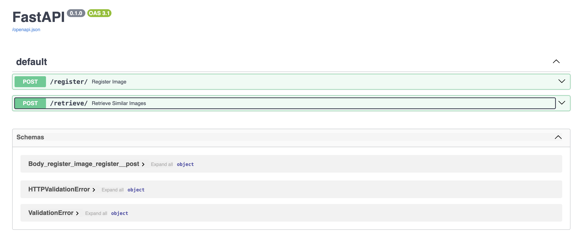

#  🏞 Image-Retrieval API 💽
An API to insert and retrieve samples stored in a vector database. This API is agnostic to the model architecture.

Drop a ⭐️!

## Start API

```sh
uvicorn main:app --host 0.0.0.0 --port 80
```

## Starting vector database

```sh
milvus-server
```


## Checkout the Swagger

You can play around the API with the docs: `http://0.0.0.0/docs`.




# Future steps

* Implement simple UI.
* More models than resnet.
* Rate limitter.
* More searching options.
* Making the code scalable.
